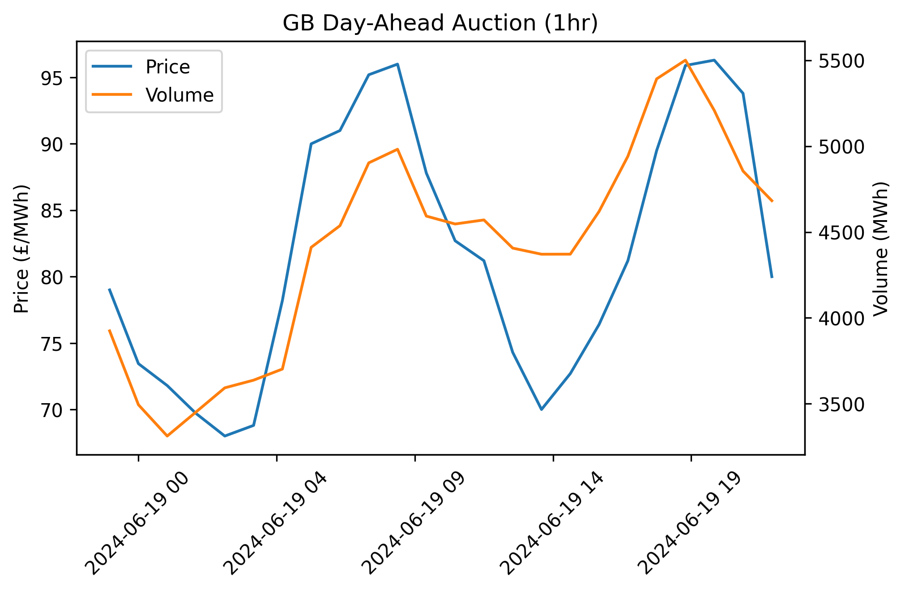

# (epex) Spot Watch
> `spot-watch` is a Python client for retrieving the latest market resylts from the EPEX SPOT Day-Ahead market.

Last updated: 2022-08-10 21:07

## Outstanding Tasks
- [ ] Automate retrieval of data
- [ ] Save out historial results
- [ ] Interactive plot
- [ ] Deploy to web